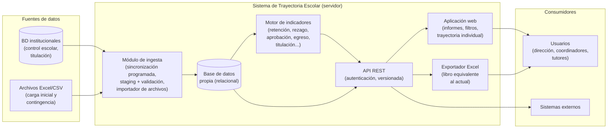
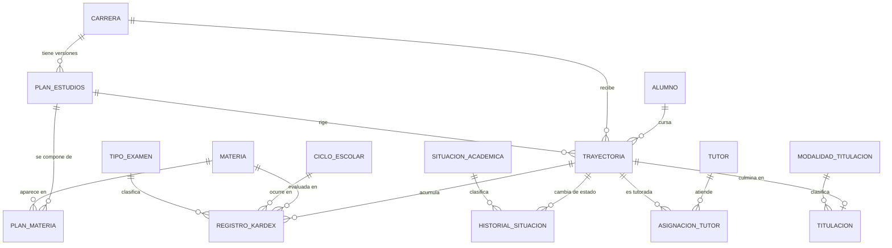
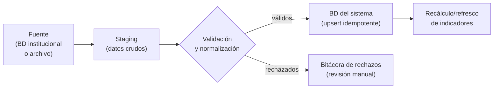

# Sistema de Trayectoria Escolar — Diseño conceptual inicial

**Facultad de Ingeniería, UASLP**
Propuesta para reemplazar el archivo `UASLP-TrayectoriaEscolar2026.xlsx` por un sistema informático de servidor.

Versión 0.1 — julio 2026 (borrador para discusión)

---

## 1. Resumen ejecutivo

Actualmente el seguimiento de la trayectoria escolar de los alumnos se realiza en un archivo de Excel que concentra el kardex completo (~47,000 registros de calificaciones), los datos de 741 alumnos de las cohortes 2010–2025, y siete hojas de análisis (retención, rezago, aprobación por materia, titulación, egreso, etc.) construidas con fórmulas y tablas dinámicas.

Este esquema tiene limitaciones estructurales:

- **Actualización manual**: cada ciclo escolar alguien debe extraer datos, pegarlos y verificar que las fórmulas sigan cubriendo los rangos correctos.
- **Fragilidad**: la lógica de los indicadores vive en fórmulas y pivotes que se rompen con facilidad y que solo entiende quien mantiene el archivo.
- **Alcance limitado**: el archivo cubre una sola carrera; replicarlo para otras implica duplicar el esfuerzo y el riesgo.
- **Sin control de acceso ni auditoría**: el archivo circula completo, con datos personales de los alumnos, sin registro de quién lo consulta o modifica.
- **Datos no consultables**: no es posible integrarlo con otros sistemas ni consultarlo programáticamente.

Se propone un **sistema web de servidor** que:

1. Se alimente automáticamente de las bases de datos de la facultad (con importación manual de Excel/CSV como respaldo).
2. Almacene los datos primarios (alumnos, kardex, planes de estudio) en una base de datos relacional propia, con soporte **multi-carrera** desde el diseño.
3. Calcule automáticamente todos los indicadores que hoy producen las hojas derivadas del Excel.
4. Presente informes en una interfaz web, con filtros por carrera, plan, cohorte y ciclo.
5. Exporte a Excel un libro equivalente al actual, para continuidad de los usuarios.
6. Exponga una **API REST** para integración con otros sistemas.

---

## 2. Análisis del archivo actual

### 2.1 Inventario de hojas

| # | Hoja | Dimensión | Naturaleza |
|---|------|-----------|------------|
| 1 | Kardex | 47,157 filas × 8 col. | **Dato fuente** |
| 2 | Datos Alumnos | 741 filas × 12 col. | **Dato fuente** |
| 3 | Rezago y Retención | matriz alumno × 22 semestres | Derivado |
| 4 | Aprobación | ciclo × ~170 materias × 18 métricas | Derivado |
| 5 | Concentrado Aprobación Materia | materia × ciclo (tasa de aprobación) | Derivado |
| 6 | Calificación Promedio Materia | materia × ciclo (promedio, %alumnos, %reprobación) | Derivado |
| 7 | Resumen | KPIs por cohorte (2015–2025) | Derivado |
| 8 | Titulación | pivote cohorte × modalidad | Derivado |
| 9 | Egreso | semestres para egresar por cohorte | Derivado |

**Conclusión clave**: solo *Kardex* y *Datos Alumnos* contienen datos primarios. Las otras siete hojas son cálculos que el sistema debe generar automáticamente a partir de ellos. Este es el corazón de la propuesta: **almacenar solo los datos fuente y derivar todo lo demás**.

### 2.2 Estructura de los datos fuente

**Kardex** — un registro por alumno/materia/oportunidad de examen:

| Campo | Ejemplo | Observaciones |
|-------|---------|---------------|
| `cve_uaslp` | `0047001` | Clave corta del alumno (conserva ceros a la izquierda) |
| `créditos` | `8` | Créditos de la materia |
| `cve_materia` | `0042` | Clave de la materia |
| `materia` | `ALGEBRA B` | Nombre (redundante con la clave → catálogo) |
| `calificación` | `80`, `AC`, `NP`… | Numérica (0–100) o código no numérico |
| `fecha_cal` | `2010-08-16` | Fecha de la calificación |
| `tipo_examen` | `EO`, `ET`, `EE`… | 17 tipos observados |
| `semestre` | `2010-2011/I` | Ciclo escolar (32 ciclos observados: 2010-2011/I a 2025-2026/II) |

Códigos no numéricos de calificación observados: `AC` (acreditada), `NP` (no presentó), `NA` (no acreditada), `SA`, `LR`, `ET`, `ER`, `EE`.

Tipos de examen observados (con frecuencia): `EO` (ordinario, 35,008), `ET` (a título, 5,415), `EE` (extraordinario, 3,729), `EA` (1,061), `ER` (regularización, 569), `CV` (convalidación, 476), `AP` (305), `IO` (254), `UO` (178), `RV` (revalidación, 58), `UE`, `IE`, `AC`, `IT`, `EU`, `AE`, `UT` (minoritarios). *El significado exacto de cada código debe validarse con Secretaría Escolar.*

**Datos Alumnos** — un registro por alumno:

| Campo | Observaciones |
|-------|---------------|
| `cve_uaslp` / `cve_larga` | Clave corta (7 dígitos) y matrícula larga (12 dígitos) |
| `nombre`, `sexo` | Datos personales |
| `generación` | Cohorte de ingreso (2010–2025) |
| `tutor` | Nombre del tutor asignado (texto libre → catálogo) |
| `fecha_egreso`, `fecha_pasante`, `fecha_titulación` | Hitos de la trayectoria |
| `situación` | 8 estados: INSCRITO (155), TITULADO (205), PASANTE (69), NO INSCRITO (132), BAJA TEMPORAL (13), BAJA DEFINITIVA (141), BAJA ACADÉMICA (25), CAMBIO DE FACULTAD (1) |
| `opción_titulación` | 12 modalidades (curso de opción, trabajo recepcional, tesis, CENEVAL, promedio, posgrado…) |
| `materias_reprobadas` | Conteo — **derivable del kardex**, no debe almacenarse |

### 2.3 Catálogos implícitos

El Excel contiene, escondidas en encabezados y valores repetidos, entidades que el sistema debe modelar explícitamente:

- **Plan de estudios**: la hoja *Aprobación* agrupa las materias en "PLAN DE ESTUDIOS JUNIO 2023" y "materias no vigentes en el plan de estudios Junio 2019", con **niveles 1–10** y tres bloques de optativas (área de extractiva, área de transformación, otros cursos optativos). Es decir, existen versiones de plan de estudios con estructura por nivel/semestre.
- **Materias**: 122 claves distintas en el kardex; ~170 columnas en las hojas de análisis.
- **Ciclos escolares**: formato `AAAA-AAAA/I` y `/II`.
- **Catálogos de códigos**: tipos de examen, situaciones académicas, modalidades de titulación, códigos de calificación no numérica.

---

## 3. Objetivos y alcance

### Objetivos

1. Eliminar la captura y el mantenimiento manual del archivo de Excel.
2. Centralizar los datos de trayectoria escolar en una base de datos con historial y auditoría.
3. Automatizar el cálculo de todos los indicadores existentes, con definiciones explícitas y verificables.
4. Habilitar el análisis **multi-carrera** con las mismas definiciones de indicadores.
5. Ofrecer informes en web, exportación a Excel y una API para otros sistemas.

### Alcance de la versión inicial

- **Dentro**: todas las carreras de la Facultad de Ingeniería (el modelo soporta N carreras y N planes por carrera desde el inicio, aunque el arranque sea con la carrera del archivo actual); consulta e informes; exportación; API de lectura; sincronización desde las fuentes institucionales.
- **Fuera** (por ahora): control escolar transaccional (inscripciones, captura de calificaciones — eso pertenece a los sistemas institucionales existentes; este sistema es de *consulta y análisis*); alcance multi-facultad; predicción de riesgo académico (posible fase futura).

El sistema es **de lectura respecto a las fuentes**: no modifica las bases de datos de la facultad; consume, consolida y analiza.

---

## 4. Actores y casos de uso

| Actor | Casos de uso principales |
|-------|--------------------------|
| **Secretaría Académica / Dirección** | Consultar KPIs por cohorte y carrera (retención, deserción, eficiencia terminal, titulación); exportar informes para organismos acreditadores (CACEI) y para la administración central. |
| **Coordinador de carrera** | Analizar aprobación y promedios por materia/ciclo para detectar materias críticas; seguir el avance de cada cohorte; comparar planes de estudio. |
| **Tutor** | Consultar la trayectoria individual (kardex, avance de créditos, rezago) de sus tutorados. |
| **Administrador del sistema** | Configurar carreras, planes y catálogos; ejecutar/supervisar la sincronización; gestionar usuarios y roles; importar archivos manualmente. |
| **Sistemas externos** | Consumir indicadores y datos vía API (p. ej. tableros institucionales, sistema de tutorías). |

---

## 5. Arquitectura conceptual

Arquitectura en capas, deliberadamente simple (los volúmenes son modestos: ~50k registros de kardex por carrera):



Decisiones de diseño:

1. **Base de datos propia**, separada de las fuentes. El sistema no consulta en vivo las BD institucionales: sincroniza hacia su propio esquema. Esto lo desacopla de la disponibilidad y estructura de las fuentes, permite datos de varias fuentes y conserva historial propio.
2. **Los indicadores se calculan, no se capturan.** Toda hoja derivada del Excel se convierte en consultas/vistas sobre los datos fuente. Dado el volumen, pueden calcularse al vuelo; si hiciera falta, se materializan tras cada sincronización.
3. **La API es la única puerta de acceso a los datos**: la aplicación web y el exportador son clientes de la misma API que consumen los sistemas externos. Así se garantiza que todos ven las mismas cifras.
4. **Importador de archivos como ciudadano de primera clase**: la carga inicial será el propio `UASLP-TrayectoriaEscolar2026.xlsx` (hojas Kardex y Datos Alumnos), y seguirá disponible como mecanismo de contingencia o para carreras cuyas fuentes aún no estén conectadas.

---

## 6. Modelo de datos conceptual



### Diccionario de entidades

**Entidades núcleo**

| Entidad | Descripción | Atributos principales |
|---------|-------------|----------------------|
| `Alumno` | Persona. Independiente de la carrera que curse. | clave UASLP corta, matrícula larga, nombre, sexo, datos de contacto |
| `Carrera` | Programa educativo de la facultad. | clave, nombre, área |
| `PlanEstudios` | Versión de plan de una carrera (p. ej. "Junio 2019", "Junio 2023"). | carrera, nombre/fecha de versión, vigencia, calificación aprobatoria (hoy `>=60`), créditos totales |
| `Materia` | Catálogo de materias. | clave (`cve_materia`), nombre, créditos |
| `PlanMateria` | Posición de una materia dentro de un plan. | plan, materia, **nivel/semestre sugerido (1–10)**, carácter (obligatoria / optativa por área: extractiva, transformación, otros), créditos en ese plan |
| `Trayectoria` | Inscripción de un alumno a una carrera; **eje del sistema**. Un alumno podría tener más de una (cambio de carrera). | alumno, carrera, plan, **cohorte/generación**, situación actual, fechas de egreso/pasantía |
| `RegistroKardex` | Una oportunidad de evaluación. Réplica del kardex fuente. | trayectoria, materia, ciclo escolar, tipo de examen, calificación numérica **o** código no numérico, fecha |
| `CicloEscolar` | Semestre lectivo. | nombre (`2025-2026/I`), fechas inicio/fin, orden |
| `HistorialSituacion` | Cambios de situación académica con fecha (el Excel solo guarda la foto actual; el sistema conserva la historia). | trayectoria, situación, fecha, origen del cambio |
| `Titulacion` | Datos de titulación. | trayectoria, modalidad, fecha |
| `Tutor` / `AsignacionTutor` | Catálogo de tutores y su asignación por periodo (hoy: texto libre y solo el tutor vigente). | tutor, trayectoria, periodo |

**Catálogos** (con clave, descripción y semántica para los cálculos)

| Catálogo | Valores iniciales (del Excel) | Semántica requerida |
|----------|-------------------------------|---------------------|
| `TipoExamen` | EO, ET, EE, ER, EA, UO, UE, UT, IO, IE, IT, AP, AC, CV, RV, AE, EU | Orden de oportunidad; si cuenta como "ordinario" para % aprobados ord. |
| `SituacionAcademica` | INSCRITO, NO INSCRITO, PASANTE, TITULADO, BAJA TEMPORAL, BAJA DEFINITIVA, BAJA ACADÉMICA, CAMBIO DE FACULTAD | Si cuenta como activo / deserción / egreso |
| `ModalidadTitulacion` | 12 modalidades observadas | Agrupación para reportes |
| `CodigoCalificacion` | AC, NP, NA, SA, LR, ET, ER, EE | Si equivale a aprobado, reprobado o neutro |

**Soporte de operación**

| Entidad | Descripción |
|---------|-------------|
| `Usuario`, `Rol` | Control de acceso (ver §11) |
| `CorridaSincronizacion` | Bitácora de cada ejecución de ingesta: fuente, fecha, registros insertados/actualizados/rechazados, errores |
| `RegistroStaging` | Área temporal donde aterrizan los datos crudos antes de validarse |

Notas de modelado:

- Las claves de alumno (`0047001`) y materia (`0042`) **se almacenan como texto** para conservar ceros a la izquierda — en el Excel esto es una fuente permanente de errores.
- `materias_reprobadas` de la hoja *Datos Alumnos* **no se almacena**: se deriva del kardex.
- La cohorte vive en `Trayectoria`, no en `Alumno`, para soportar cambios de carrera correctamente.

---

## 7. Indicadores y reportes

Cada hoja derivada del Excel se reformula como un informe parametrizable (carrera, plan, cohorte, ciclo, rango de ciclos). Las definiciones siguientes están inferidas del archivo y **deben validarse con Secretaría Académica** antes de implementarse:

| Informe (hoja origen) | Definición inferida |
|------------------------|---------------------|
| **Retención** (*Rezago y Retención*, *Resumen*) | Por cohorte: matriz alumno × ciclo con inscrito sí/no (derivada de existencia de registros de kardex en el ciclo o del historial de situación); retención = proporción de la cohorte aún activa a N semestres. |
| **Rezago** (*Rezago y Retención*) | Diferencia entre los semestres cursados y los que corresponderían al avance en el plan; valores negativos = adelanto; ABANDONO/RENUNCIA como estados terminales. |
| **Deserción / abandono** (*Resumen*) | Por cohorte: alumnos que abandonan, desglosados por semestre en que ocurre (0, 1, 2, …). |
| **Aprobación por materia y tipo de examen** (*Aprobación*) | Por ciclo × materia: inscritos, conteo de resultados por cada tipo de examen, % aprobados en ordinario y % aprobados global, agrupado por nivel del plan. |
| **Tasa de aprobación por materia** (*Concentrado*) | Serie temporal de la tasa de aprobación de cada materia. |
| **Calificación promedio por materia** (*Calificación Promedio*) | Promedio (solo calificaciones numéricas), % de alumnos y % de reprobación por materia × ciclo. |
| **Resumen por cohorte** (*Resumen*) | Admitidos, renuncias, cambios de carrera, inscritos; distribución de materias reprobadas (0 / 1–3 / 4+); abandono por semestre; **eficiencia terminal**; retención; titulados/pasantes y sus proporciones respecto a cohorte y a egresados; distribución de rezago. |
| **Titulación** (*Titulación*) | Titulados por cohorte × modalidad. |
| **Egreso** (*Egreso*) | Promedio y distribución de semestres para egresar, por cohorte y situación. |
| **Trayectoria individual** (nuevo) | Kardex del alumno con avance de créditos contra su plan, semáforo de rezago — hoy no existe como vista en el Excel y es la necesidad principal de los tutores. |

El motor de indicadores debe mantener las definiciones **en un solo lugar** (vistas SQL o servicios documentados), de modo que web, API y exportador produzcan cifras idénticas.

---

## 8. Ingesta de datos

### 8.1 Fuentes

El sistema se alimentará de las bases de datos de la facultad/universidad. Punto crítico a confirmar en Fase 0 (ver §13): qué sistemas son (control escolar central, sistema de titulación, tutorías), qué motor usan, y qué mecanismo de acceso se autoriza (vista de solo lectura, réplica, exportes periódicos, servicios web institucionales).

### 8.2 Estrategia



- **Sincronización batch programada** (p. ej. nocturna; los datos escolares no requieren tiempo real).
- **Staging + validación** antes de tocar las tablas definitivas: claves con formato correcto, materias y alumnos existentes en catálogos, calificaciones en rango o código conocido, ciclo escolar válido.
- **Cargas idempotentes** (upsert por clave natural): re-ejecutar una sincronización no duplica registros.
- **Bitácora por corrida** (`CorridaSincronizacion`): qué se insertó, actualizó y rechazó, y por qué. Los rechazos se revisan desde la interfaz de administración.
- **Importador manual** de Excel/CSV con el mismo pipeline de staging/validación: sirve para la migración inicial del archivo actual y como contingencia.

### 8.3 Migración inicial

1. Importar las hojas *Kardex* y *Datos Alumnos* del archivo actual.
2. Construir los catálogos (materias, tipos de examen, situaciones, modalidades, ciclos) a partir de los valores observados, validándolos con Secretaría.
3. Capturar los planes de estudio (Junio 2019, Junio 2023) con sus niveles y optativas.
4. **Validar contra el Excel**: reproducir las 7 hojas derivadas y comparar cifra por cifra contra el archivo original. Esta comparación es el criterio de aceptación de la migración.

---

## 9. API

Principios: REST sobre HTTPS, JSON, versionada (`/api/v1/`), autenticación por token (usuarios humanos vía la aplicación web; sistemas externos vía tokens de servicio), permisos por rol y por carrera.

Recursos principales (lectura; la escritura queda restringida a administración de catálogos e importaciones):

```
GET  /api/v1/carreras
GET  /api/v1/carreras/{id}/planes
GET  /api/v1/planes/{id}/materias
GET  /api/v1/alumnos?carrera=&cohorte=&situacion=&buscar=
GET  /api/v1/alumnos/{clave}
GET  /api/v1/alumnos/{clave}/kardex
GET  /api/v1/alumnos/{clave}/trayectoria        # avance, rezago, situación histórica
GET  /api/v1/ciclos

# Indicadores (todos aceptan ?carrera=&plan=&cohorte=&ciclo=)
GET  /api/v1/indicadores/resumen-cohortes
GET  /api/v1/indicadores/retencion
GET  /api/v1/indicadores/rezago
GET  /api/v1/indicadores/aprobacion?materia=&ciclo=
GET  /api/v1/indicadores/promedios-materia
GET  /api/v1/indicadores/titulacion
GET  /api/v1/indicadores/egreso

# Exportaciones
POST /api/v1/exportaciones/excel            # genera el libro; devuelve id
GET  /api/v1/exportaciones/{id}             # estado / descarga

# Administración
POST /api/v1/importaciones                  # subir Excel/CSV a staging
GET  /api/v1/sincronizaciones               # bitácora de corridas
```

---

## 10. Exportación a Excel

Para no romper los flujos actuales (informes a acreditadores, hábitos de los usuarios), el sistema generará **un libro de Excel equivalente al actual**: mismas 9 hojas, mismos encabezados, cifras calculadas por el motor de indicadores, filtrable por carrera y rango de cohortes. Adicionalmente, cada informe de la interfaz web tendrá exportación individual (Excel/CSV).

Esto convierte al Excel en lo que debe ser: **un formato de salida**, no la base de datos.

---

## 11. Consideraciones no funcionales

| Aspecto | Consideración |
|---------|---------------|
| **Protección de datos personales** | El sistema maneja datos personales de alumnos (nombre, sexo, trayectoria). Aplica la LGPDPPSO (sujetos obligados). Implica: minimización de datos, aviso de privacidad, acceso restringido por rol, cifrado en tránsito (HTTPS) y en reposo, y no exponer datos personales en endpoints de indicadores agregados. |
| **Roles y permisos** | Mínimo: *Administrador* (todo), *Dirección/Secretaría* (todos los informes, todas las carreras), *Coordinador* (informes de su carrera), *Tutor* (solo trayectorias de sus tutorados), *Sistema externo* (tokens con alcance explícito). |
| **Auditoría** | Registro de accesos a datos individuales y de toda operación de administración e importación. |
| **Desempeño** | Volúmenes pequeños (~50k registros de kardex por carrera; < 1M en total previsible). Una base relacional bien indexada responde todo al vuelo; no se requiere infraestructura de big data. |
| **Disponibilidad y respaldos** | Respaldo diario automatizado de la BD; la sincronización re-ejecutable hace tolerable una restauración. |
| **Despliegue** | Un solo servidor (o VM/contenedores) dentro de la infraestructura de la facultad/universidad es suficiente. |

---

## 12. Criterios de selección de stack (propuesta agnóstica)

La propuesta no se casa con una tecnología. Cualquier stack elegido debe cubrir: framework web maduro con ORM, generación de Excel, tareas programadas (sincronización) y autenticación/roles. Opciones típicas:

| Opción | A favor | A considerar |
|--------|---------|--------------|
| **Python** (Django o FastAPI + PostgreSQL) | Ecosistema fuerte de datos y reportes (pandas, openpyxl); Django trae admin, usuarios y ORM de fábrica; común en entornos académicos | — |
| **PHP** (Laravel + MySQL/PostgreSQL) | Muy extendido en infraestructura web universitaria; hosting sencillo | Generación de Excel vía PhpSpreadsheet |
| **Node.js/TypeScript** (NestJS + PostgreSQL) | Un solo lenguaje si el frontend es JS; buen soporte de API | Ecosistema de análisis de datos más limitado |

Criterios de decisión (en este orden):

1. **Capacidades del equipo** que va a mantener el sistema — el criterio dominante.
2. **Infraestructura y estándares existentes** en la facultad/UASLP (servidores, DBAs, lineamientos de TI).
3. Ecosistema para reportes/Excel y ETL.

Para la base de datos se recomienda **PostgreSQL** en cualquier caso (vistas materializadas para indicadores, robustez, sin costo de licencia); MySQL/MariaDB es alternativa válida si es el estándar institucional.

---

## 13. Hoja de ruta por fases

| Fase | Contenido | Resultado |
|------|-----------|-----------|
| **0. Validación** | Confirmar con Secretaría Académica/Escolar: semántica de códigos (tipos de examen, calificaciones no numéricas), definiciones exactas de cada indicador, y acceso real a las fuentes institucionales (motor, mecanismo, permisos). | Especificación validada; decisión de stack. |
| **1. Núcleo** | BD con el modelo del §6; importador de Excel; migración del archivo actual; motor de indicadores; informes web básicos (resumen por cohorte, aprobación por materia, trayectoria individual). **Criterio de aceptación: reproducir las 7 hojas derivadas del Excel con cifras idénticas.** | El Excel deja de ser la fuente de verdad. |
| **2. Automatización** | Conexión y sincronización programada con las BD institucionales; bitácora y manejo de rechazos; API v1 completa con autenticación. | El sistema se actualiza solo cada ciclo. |
| **3. Consolidación** | Exportador del libro completo; roles finos (tutores); alta de las demás carreras de la facultad; auditoría completa. | Sistema multi-carrera en operación. |
| **4. (Futuro)** | Alertas tempranas de riesgo académico, comparativas entre carreras, tableros institucionales. | Valor analítico adicional. |

---

## 14. Riesgos y preguntas abiertas

| # | Riesgo / pregunta | Mitigación propuesta |
|---|-------------------|----------------------|
| 1 | **Acceso a las fuentes**: ¿se autorizará acceso de lectura a las BD institucionales? ¿Qué sistemas y motores son? | Fase 0 lo resuelve antes de construir; el importador manual garantiza que el sistema es útil aun sin acceso directo. |
| 2 | **Semántica de códigos**: significado exacto de los 17 tipos de examen y 8 códigos de calificación; reglas de aprobación por plan. | Catálogos con semántica configurable (§6); validación con Secretaría en Fase 0. |
| 3 | **Definiciones de indicadores**: las fórmulas del Excel pueden contener supuestos no documentados (p. ej. cómo se cuenta "inscrito" en la matriz de retención). | Criterio de aceptación de Fase 1: reproducir cifra por cifra el archivo actual y documentar cada discrepancia encontrada. |
| 4 | **Calidad de datos**: claves con ceros perdidos, nombres de tutor en texto libre, duplicados. | Pipeline de staging con validación y bitácora de rechazos (§8). |
| 5 | **Cambios de plan de estudios y equivalencias** entre planes (materias no vigentes cursadas por cohortes en estudio). | El modelo separa `Materia` de `PlanMateria`; las equivalencias entre planes se modelan en Fase 3 si se requieren. |
| 6 | **Adopción**: usuarios habituados al Excel. | Exportador del libro equivalente (§10) desde Fase 3, e informes web que repliquen las vistas conocidas. |
| 7 | **Datos personales**: circulación actual del archivo completo. | Roles/permisos y auditoría desde Fase 1; los endpoints agregados no exponen datos individuales. |

---

*Documento generado a partir del análisis de `UASLP-TrayectoriaEscolar2026.xlsx` (9 hojas; kardex de 47,157 registros; 741 alumnos; cohortes 2010–2025; 32 ciclos escolares).*
